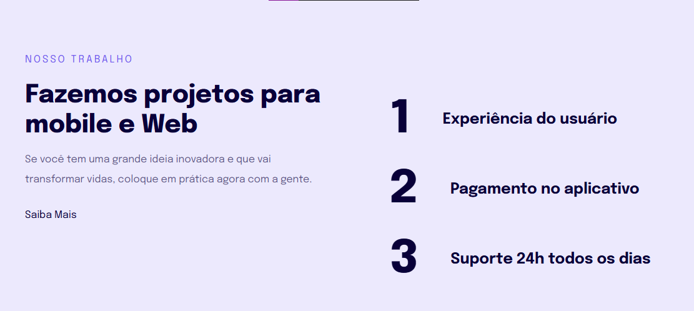
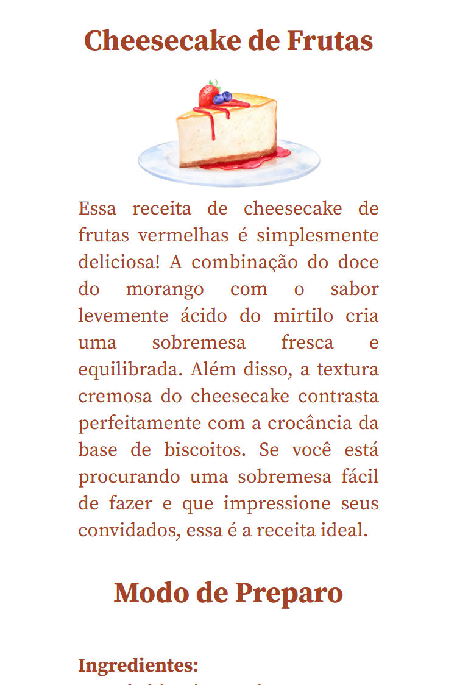
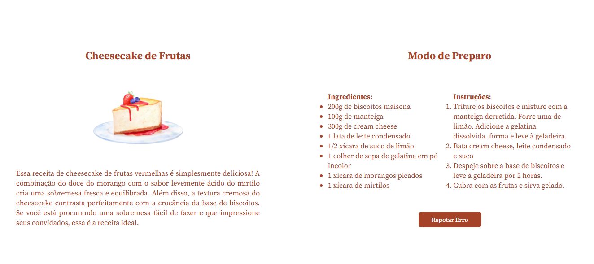
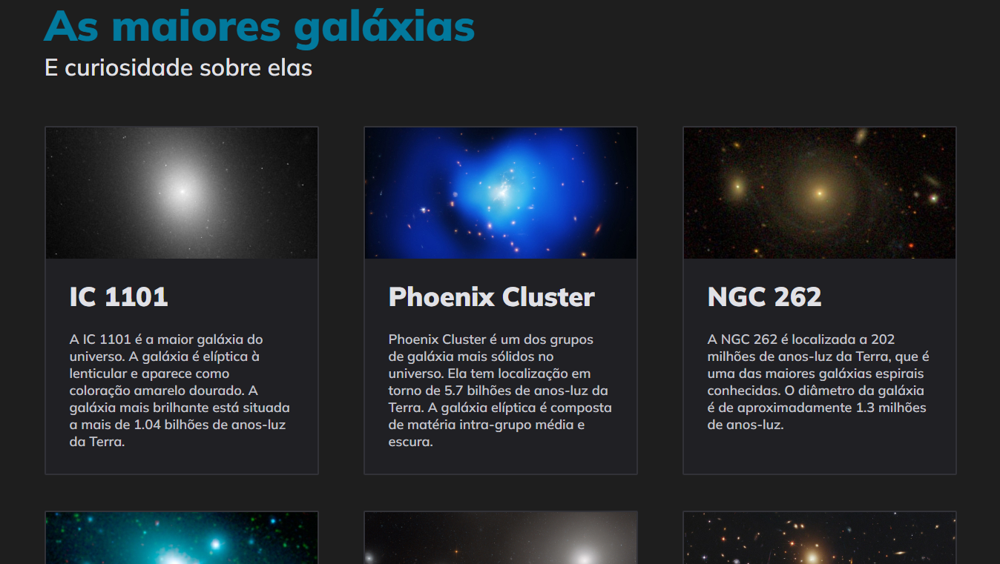
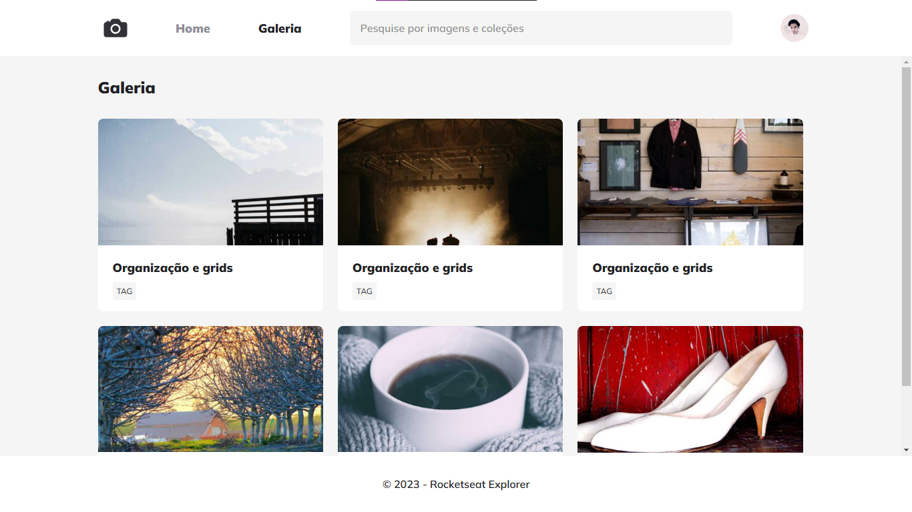
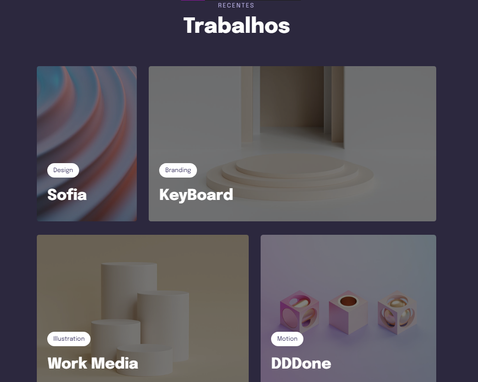

# STAGE 3

Coleção de Projetos feito na Rocketseat - Explorer

## Projeto 4 - Apresentação

## Projeto 5 - Cheesecake de frutas

  
  

## Projeto 6 - Galáxia

## Projeto 7 - FotoBlog

## Projeto 7 - Mural

